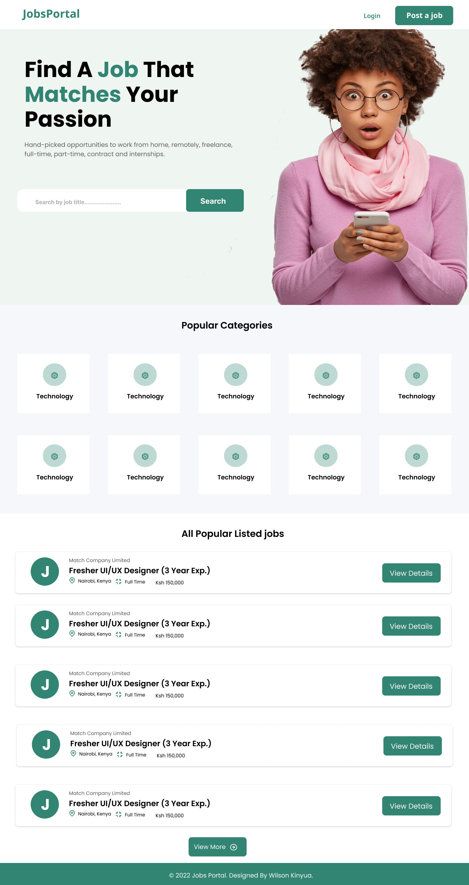
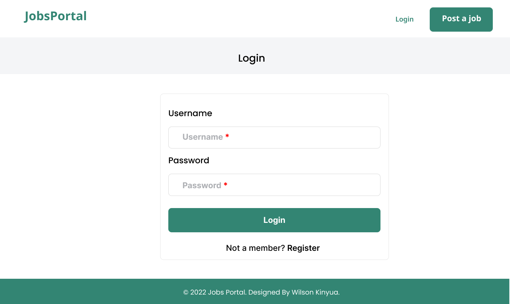
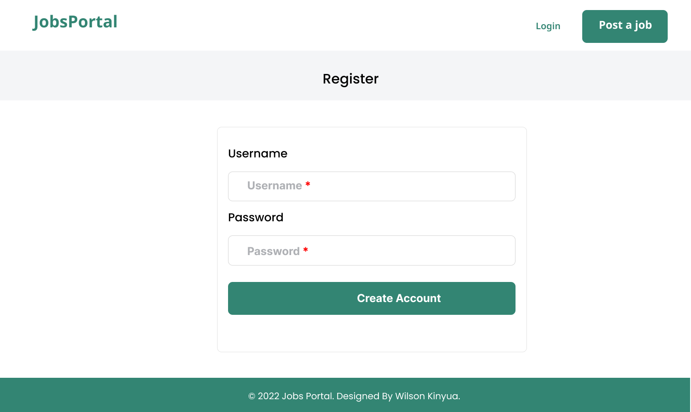

# JobsPortal

#### Created By Wilson Kinyua on 25-04-2022

## Design Link

[Figma](https://www.figma.com/file/UF3jKVnX4320r7r2V7P6pI/Jobs-Portal?node-id=56%3A133)

## Description

Jobs Portal is a a website that provides a way to create, update, delete and retrieve jobs. It also provides a way to create and retrieve a user.

## Setup Requirements

- Git
- Web-browser or your choice
- Github
- Angular CLI (https://cli.angular.io/)
- Node.js (https://nodejs.org/)
- NPM (https://www.npmjs.com/)

## Development server

Run `ng serve` for a dev server. Navigate to `http://localhost:4200/`. The app will automatically reload if you change any of the source files.

## Code scaffolding

Run `ng generate component component-name` to generate a new component. You can also use `ng generate directive|pipe|service|class|guard|interface|enum|module`.

## Build

Run `ng build` to build the project. The build artifacts will be stored in the `dist/` directory.

## Running unit tests

Run `ng test` to execute the unit tests via [Karma](https://karma-runner.github.io).

## Running end-to-end tests

Run `ng e2e` to execute the end-to-end tests via a platform of your choice. To use this command, you need to first add a package that implements end-to-end testing capabilities.

## Technologies Used

The following have been used on this project:

- HTML
- CSS
- Bootstrap
- Angular
- Figma

#### Live link to view the project <a href="https://jobs-portal-frontend.netlify.app/">View Jobs Portal</a>

## Screenshots Of the Figma Design

- Homepage

  

- Job Details

  

- Create Job Form Page

  

- Jobs List

  

- Login Page

  

- Register Page

  

## Known Bugs

So far so good there are no bugs related to this project 😎

## Support and contact details 🙂

To make a contribution to the code used or any suggestions you can click on the contact link and email me your suggestions.

- Email: wilsonkinyuam@gmail.com

## License

Copyright (c) 2022 Wilson Kinyua Muthoni.

Permission is hereby granted, free of charge, to any person obtaining a copy
of this software and associated documentation files , to deal
in the Software without restriction, including without limitation the rights
to use, copy, modify, merge, publish, distribute, sublicense, and/or sell
copies of the Software, and to permit persons to whom the Software is
furnished to do so, subject to the following conditions:

The above copyright notice and this permission notice shall be included in all
copies or substantial portions of the Software.

THE SOFTWARE IS PROVIDED "AS IS", WITHOUT WARRANTY OF ANY KIND, EXPRESS OR
IMPLIED, INCLUDING BUT NOT LIMITED TO THE WARRANTIES OF MERCHANTABILITY,
FITNESS FOR A PARTICULAR PURPOSE AND NONINFRINGEMENT. IN NO EVENT SHALL THE
AUTHORS OR COPYRIGHT HOLDERS BE LIABLE FOR ANY CLAIM, DAMAGES OR OTHER
LIABILITY, WHETHER IN AN ACTION OF CONTRACT, TORT OR OTHERWISE, ARISING FROM,
OUT OF OR IN CONNECTION WITH THE SOFTWARE OR THE USE OR OTHER DEALINGS IN THE
SOFTWARE.
